<div align="center">

<!-- ================= NATIVE ANIMATED CYBER HEADER ================= -->


<!-- ================= DYNAMIC ANIMATED TYPING SVG ================= -->
<a href="https://babudev.me">
  
</a>

<br/>

<!-- ================= STATUS & UPLINK PILL BADGES ================= -->
<p align="center">
  <a href="https://babudev.me"></a>
  <a href="https://linkedin.com/in/babu-b"></a>
  <a href="mailto:babusanthosh6381@gmail.com"></a>
  <a href="https://github.com/Babu16102005"></a>
</p>

</div>

---

### 🛰️ LIVE SYSTEM TELEMETRY & NEURAL METRICS

<div align="center">
  
</div>

<br/>

---

### 🛠️ TECHNICAL ARSENAL & SKILL MATRIX

<div align="center">

| Architecture Layer | Core Stack & Frameworks |
| :--- | :--- |
| **Backend & Microservices** | `Java` • `Spring Boot` • `Python` • `FastAPI` • `REST APIs` • `WebSockets` |
| **Frontend & UI Engineering** | `React.js` • `JavaScript (ES6+)` • `Tailwind CSS` • `Vite` • `Modern Responsive UX` |
| **Databases & Cloud Infra** | `PostgreSQL` • `Supabase` • `Appwrite` • `Firebase` • `Docker` • `Linux / Bash` |
| **AI Systems & Intelligence** | `Retrieval-Augmented Generation (RAG)` • `Gemini API` • `LLM Orchestration` • `DSA` |
| **Engineering & CI/CD Tools** | `Git` • `GitHub Actions` • `Postman` • `VS Code` • `Self-Hosting Modules` |

<br/>

<!-- ANIMATED TECH ICONS GRID -->
<p align="center">
  <a href="https://skillicons.dev">
    
  </a>
</p>

</div>

---

### 🚀 FEATURED PRODUCTION & AI PLATFORMS

<table>
  <tr>
    <td width="33%" valign="top">
      <h3>🤖 SMART MENTIS</h3>
      <p><b>AI-Powered Career Guidance Ecosystem</b></p>
      <ul>
        <li>Contextual career AI advisor with interactive multi-step roadmaps.</li>
        <li>Adaptive MCQ assessment engine with personalized learning analytics.</li>
        <li>Integrated Gemini AI reasoning & automated YouTube curation algorithms.</li>
        <li>Secure telemetry tracking & user credential management.</li>
      </ul>
      <p>
        
        
        
        
      </p>
    </td>
    <td width="33%" valign="top">
      <h3>🚨 VITA5</h3>
      <p><b>Real-Time Emergency Safety & SOS Mesh</b></p>
      <ul>
        <li>One-tap instant emergency SOS with live GPS location broadcast.</li>
        <li>Cryptographic token session auth & trusted contact alert mesh.</li>
        <li>Engineered for split-second emergency accessibility and zero latency.</li>
        <li>Cloud database dispatch ledger with automated notification dispatch.</li>
      </ul>
      <p>
        
        
        
        
      </p>
    </td>
    <td width="33%" valign="top">
      <h3>💬 KIBA</h3>
      <p><b>Real-Time High-Throughput Messaging Engine</b></p>
      <ul>
        <li>Full-duplex private 1-on-1 messaging infrastructure with WebSockets.</li>
        <li>Low-latency event synchronization and persistent message ledgers.</li>
        <li>Robust Spring Boot enterprise backend with relational data indexing.</li>
        <li>Encrypted session payload validation & client connection pooling.</li>
      </ul>
      <p>
        
        
        
        
      </p>
    </td>
  </tr>
</table>

---

### 💼 PROFESSIONAL EXPERIENCE & LEADERSHIP LOG

```yaml
experience_telemetry:
  - role: "Software Engineering Intern"
    company: "MUA Technologies Pvt Ltd (MUA Cloud)"
    timeline: "Dec 2025 – Jan 2026"
    impact:
      - "Deployed 3+ self-hosted application modules, optimizing environment architecture & CI/CD."
      - "Integrated Appwrite Authentication & production database schemas across 3+ live features."
      - "Maintained Git/GitHub collaborative workflows and authored internal technical architecture docs."

  - role: "Event Coordinator"
    event: "INTELINFO 2K25 (National Level Technical Symposium)"
    impact:
      - "Spearheaded technical operations and staging for 300+ engineering participants."
      - "Streamlined automated attendee registrations, schedules, and event delivery."

  - role: "Volunteer & Student Coordinator"
    organization: "VGLUG (Villupuram GNU/Linux Users Group)"
    impact:
      - "Evaluated and interviewed 50+ applicant engineers for open-source technical cohorts."
      - "Coordinated Linux/FOSS developer workshops and open-source mentorship sessions."
```

---

### 🏆 CERTIFICATIONS & HONORS

- 🥇 **1st Prize Winner — Technical Paper Presentation (3x Champion)**
- 📜 **IBM SkillsBuild Certification** — *Getting Started With Artificial Intelligence*
- 📜 **Java Fundamentals Certification** *(August 2025)*
- 📜 **Python Programming Certification** *(October 2025)*

---

### 📊 ANIMATED TELEMETRY & GITHUB ACTIVITY

<div align="center">

<!-- STREAK STATS ANIMATION -->
<p align="center">
  
</p>

<!-- GITHUB STATS & TOP LANGS -->
<p align="center">
  
  &nbsp;
  
</p>

<!-- CONTRIBUTION ACTIVITY GRAPH -->
<p align="center">
  
</p>

<!-- CONTRIBUTION SNAKE ANIMATION -->
<p align="center">
  
</p>

</div>

---

### 🌐 TRANSMISSION CHANNELS & SOCIAL UPLINK

<div align="center">

<a href="https://babudev.me">
  
</a>
&nbsp;
<a href="https://linkedin.com/in/babu-b">
  
</a>
&nbsp;
<a href="https://github.com/Babu16102005">
  
</a>
&nbsp;
<a href="mailto:babusanthosh6381@gmail.com">
  
</a>

<br/><br/>

```
[ TRANSMISSION END ] // Designed with high-performance precision for Babu B
```

<!-- NATIVE ANIMATED FOOTER WAVE -->


</div>
